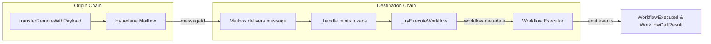

# Hyperlane HypERC20 (Foundry) - Deterministic 2-chain Warp Route (Base / Mantle Sepolia)

This repo deploys a workflow-enabled Hyperlane `HypERC20` (burn/mint) across Base Sepolia and Mantle Sepolia. Deployments rely on the EIP-2470 singleton factory + `CREATE2`, so every chain receives a deterministic address for the mailbox-specific bytecode, and `transferRemoteWithPayload` carries workflow metadata across domains.

---

## What you get
- `src/token/TokenHypERC20.sol` - `HypERC20` router with workflow execution (`transferRemoteWithPayload`, metadata decoding, executor rotation).
- `script/token/DeployTokenHypERC20.s.sol` - deterministic deployment plus helper functions to manage workflow executors.
- `script/token/EnrollRouters.s.sol` - enroll Base <-> Mantle routers (required for bridging).
- `script/token/BridgeExample.s.sol` - quick `transferRemote` / `transferRemoteWithPayload` example.
- `script/token/BridgeExampleWorkflow.s.sol` - bridge helper that assembles workflow metadata.
- `test/unit/token/TokenHypERC20.t.sol` - Foundry unit tests that validate mocks, dispatcher wiring, and workflow hooks.

---

## Prerequisites
- Foundry (`forge`, `cast`, `anvil`) >= nightly 2023-10-01.
- RPC URLs for Base Sepolia (`84532`) and Mantle Sepolia (`5003`).
- Funded deployer EOA (the same `PRIVATE_KEY` per chain if you want deterministic addresses).
- Hyperlane mailbox addresses for both testnets (see the Hyperlane registry).

---

## Install dependencies
```bash
forge install foundry-rs/forge-std --no-commit
forge install OpenZeppelin/openzeppelin-contracts --no-commit
forge install OpenZeppelin/openzeppelin-contracts-upgradeable --no-commit
forge remappings > remappings.txt
```

> Hyperlane Solidity sources live under `lib/hyperlane-monorepo/solidity/contracts`, and remappings already map `@hyperlane-xyz/core/` to that folder.

---

## Configure env (`.env.token`)

```bash
cp .env.example .env.token
```

Load the token env file before every Forge command:
```bash
set -a && source .env.token && forge test -vvv
# or
dotenv -f .env.token forge script ...
```

### Token profiles (multi-token deployments)
- `TOKEN_PROFILE` selects which profile scripts operate on (defaults to `MUSDC`).
- Each profile overrides attributes through `TOKEN_<PROFILE>_*` keys (name, symbol, decimals, scale, total supply, workflow executor, address).
- Global defaults (`TOKEN_NAME`, `TOKEN_SYMBOL`, `TOKEN_DECIMALS`, `TOTAL_SUPPLY`, `WORKFLOW_EXECUTOR`) fill any missing keys.

Built-in profiles (set via `TOKEN_PROFILE`):
- `MUSDC` - Mock USDC (6 decimals)
- `MUSDT` - Mock USDT (6 decimals)
- `MNT` - Mock Mantle (18 decimals)
- `METH` - Mock Ethereum (18 decimals)
- `MPUFF` - Mock Puff The Dragon (18 decimals)
- `MAXL` - Mock Axelar (18 decimals)
- `MSVL` - Mock Slash Vision Labs (18 decimals)
- `MLINK` - Mock Chainlink (18 decimals)
- `MWBTC` - Mock Wrapped BTC (8 decimals)
- `MPENDLE` - Mock Pendle (18 decimals)

Make shortcuts:
- Single profile (defaults to `TOKEN_PROFILE`): `make deploy` (deploy + enroll on Base & Mantle).
- Batch all profiles in `TOKEN_PROFILES`: `make deploy-all-profiles` (loops deploy + enroll per profile) or just enroll with `make enroll-all-profiles`.

### Important env notes
- `SALT_STRING` is hashed inside the deploy script. Keeping `SALT_STRING` and constructor args identical makes deployments deterministic per mailbox.
- `MAILBOX` is part of the constructor, so changing it changes the init code hash. Hyperlane mailboxes differ across chains, so you cannot share one address across Base + Mantle without re-architecting the deploy flow.
- `.env.token` ships with `BASE_SEPOLIA_DOMAIN`, `MANTLE_SEPOLIA_DOMAIN`, RPC URLs, and placeholders for per-profile token addresses.

---

## Compile + test locally
```bash
dotenv -f .env.token forge build
dotenv -f .env.token forge test -vvv
```

---

## Deploy (deterministic) via Makefile
Make targets wrap `script/token/DeployTokenHypERC20.s.sol:DeployTokenHypERC20` and handle Base + Mantle:
- Set `TOKEN_PROFILE` to one of the profiles above (defaults to `MUSDC` if omitted).
- Ensure `.env.token` has `BASE_MAILBOX`, `MANTLE_MAILBOX`, RPC URLs, and `ETHERSCAN_API_KEY`.

### Single profile (Base + Mantle + enroll)
```bash
# choose profile: MUSDC, MUSDT, MNT, METH, MPUFF, MAXL, MSVL, MLINK, MWBTC, MPENDLE
TOKEN_PROFILE=MUSDC make deploy
```

### Single profile (step-by-step)
```bash
TOKEN_PROFILE=MUSDC make token-hyp-deploy-base
TOKEN_PROFILE=MUSDC make token-hyp-deploy-mantle
TOKEN_PROFILE=MUSDC make token-hyp-enroll-all   # enroll after both deploys
```

### All profiles listed in `TOKEN_PROFILES`
```bash
make deploy-all-profiles      # deploy + enroll for every profile in TOKEN_PROFILES
# or only enroll (skip deploy) if addresses are already set:
make enroll-all-profiles
```

After each deployment, update `.env.token` with the emitted address (same for both chains), e.g.:
```env
TOKEN_ADDRESS_<PROFILE>=0x...
TOKEN_<PROFILE>_WORKFLOW_EXECUTOR=0x...   # only when the script deployed a mock
```

---

## Enroll remote routers (required)
Enrollment is included in `make deploy` / `make deploy-all-profiles`, but you can run it directly (uses `TOKEN_ADDRESS_<PROFILE>`):
```bash
# enroll a single profile on both chains (addresses must be in .env.token)
TOKEN_PROFILE=MUSDC make token-hyp-enroll-all

# enroll all profiles listed in TOKEN_PROFILES
make enroll-all-profiles
```

---

## Bridge test (`transferRemote`)
Send `AMOUNT` tokens from the current chain to `DEST_DOMAIN`:
```bash
export TOKEN_PROFILE=MUSDC
export DEST_DOMAIN=5003               # Mantle Sepolia
export RECIPIENT=0xYourDestAddress
export AMOUNT=1000000000000000000     # 1 token (18 decimals)
export GAS_PAYMENT=10000000000000000  # 0.01 native token (wei)
export ADDITIONAL_DATA=0x             # optional payload

forge script script/token/BridgeExampleWorkflow.s.sol:BridgeExampleWorkflow \
  --rpc-url $BASE_SEPOLIA_RPC_URL \
  --broadcast \
  -vvv
```

When `ADDITIONAL_DATA` is non-empty the script calls `transferRemoteWithPayload`, emitting `AdditionalDataSent` (origin) and `AdditionalDataReceived` (destination).

> Mantle Sepolia currently reports `interchainGasPaymaster: 0x000...0`. When bridging to or from Mantle, set `GAS_PAYMENT=0` or the mailbox hook may revert.

---

## Bridge via `cast send`
Common setup:
```bash
export TOKEN_PROFILE=MUSDC
export TOKEN_ADDRESS=$TOKEN_ADDRESS_MUSDC          # override if needed
export PRIVATE_KEY=0xyourpk
export RECIPIENT=0xRecipient
export AMOUNT=1000000000000000000
export GAS_PAYMENT=10000000000000000
export ADDITIONAL_DATA=0x
RECIPIENT_B32=$(cast to-bytes32 $RECIPIENT)
```

### Base -> Mantle (domain 5003)
```bash
cast send $TOKEN_ADDRESS \
  "transferRemote(uint32,bytes32,uint256)" \
  5003 \
  $RECIPIENT_B32 \
  $AMOUNT \
  --rpc-url $BASE_SEPOLIA_RPC_URL \
  --private-key $PRIVATE_KEY \
  --value $GAS_PAYMENT
```
Need metadata? Switch to `transferRemoteWithPayload(uint32,bytes32,uint256,bytes)` and append `$ADDITIONAL_DATA`.

### Mantle -> Base (domain 84532)
```bash
cast send $TOKEN_ADDRESS \
  "transferRemote(uint32,bytes32,uint256)" \
  84532 \
  $RECIPIENT_B32 \
  $AMOUNT \
  --rpc-url $MANTLE_SEPOLIA_RPC_URL \
  --private-key $PRIVATE_KEY \
  --value $GAS_PAYMENT
```

---

## Workflow execution
`TokenHypERC20` executes workflows automatically when metadata begins with `keccak256("WORKFLOW")` followed by `abi.encode(WorkflowData)`. This enables cross-chain automation (swaps, staking, multi-step DeFi flows, etc.).

### Architecture
```
Origin Chain                     Destination Chain
     |                                 |
     | transferRemoteWithPayload       |
     | + workflow data  -------------> | process()
     |                                 |  \_ _handle()
     |                                 |     |- mint tokens
     |                                 |     \- _tryExecuteWorkflow()
     |                                 |           \- external executor
```

Mermaid overview:



### Deploy workflow token
```bash
export TOKEN_PROFILE=MUSDC
export MAILBOX=$BASE_MAILBOX
forge script script/token/DeployTokenHypERC20.s.sol:DeployTokenHypERC20 \
  --rpc-url $BASE_SEPOLIA_RPC_URL \
  --broadcast \
  --verify \
  -vvv
```

Need a mock executor first?
```bash
forge script script/token/DeployTokenHypERC20.s.sol:deployMockWorkflowExecutor \
  --rpc-url $BASE_SEPOLIA_RPC_URL \
  --broadcast \
  -vvv
```

### Configure workflow env
```env
TOKEN_MUSDC_WORKFLOW_EXECUTOR=0xYourWorkflowContract
USE_WORKFLOW=true
```

### Bridge with workflow metadata
```bash
export TOKEN_PROFILE=MUSDC
export DEST_DOMAIN=5003
export RECIPIENT=0xYourWallet
export AMOUNT=100000000000000000000   # 100 tokens
export GAS_PAYMENT=0

forge script script/token/BridgeExampleWorkflow.s.sol:BridgeExampleWorkflow \
  --rpc-url $BASE_SEPOLIA_RPC_URL \
  --broadcast \
  -vvv
```

### Manage workflow executors
```bash
# update executor
export TOKEN_PROFILE=MUSDC
export TOKEN_ADDRESS=$TOKEN_ADDRESS_MUSDC
export NEW_WORKFLOW_EXECUTOR=0xNewExecutor
forge script script/token/DeployTokenHypERC20.s.sol:updateWorkflowExecutor \
  --rpc-url $BASE_SEPOLIA_RPC_URL \
  --broadcast \
  -vvv

# check executor
export TOKEN_PROFILE=MUSDC
script script/token/DeployTokenHypERC20.s.sol:checkWorkflowExecutor \
  --rpc-url $BASE_SEPOLIA_RPC_URL \
  -vvv
```

### Workflow data structure
```solidity
struct Action {
    uint8 actionType;
    address target;
    bytes data;
    uint256 inputAmountPercentage;
}

struct WorkflowData {
    Action[] actions;
}
```

---

## Testing
```bash
# focus on TokenHypERC20
forge test --match-contract TokenHypERC20Test -vvv

# run entire suite
forge test -vvv
```

---

## Troubleshooting
- **Address mismatch across chains** - deployments are deterministic; if addresses differ, check `SALT_STRING`, constructor args, and `MAILBOX` per chain. Once they match, set `TOKEN_ADDRESS_<PROFILE>` once for both.
- **Workflow not triggering** - ensure `USE_WORKFLOW=true`, `WORKFLOW_EXECUTOR` is non-zero, and metadata is prefixed with `keccak256("WORKFLOW")`. The workflow bridge helper already handles this.
- **Router enrollment reverts** - confirm `TOKEN_ADDRESS_<PROFILE>` is populated (or supply global fallback: `TOKEN_ADDRESS`).
- **Forge ignores `.env.token`** - prefix commands with `dotenv -f .env.token` (or export variables before running `forge ...`).
- **Mantle gas payment reverts** - set `GAS_PAYMENT=0` when the destination mailbox lacks an Interchain Gas Paymaster.

---

## References
- Hyperlane warp route documentation (mailboxes, hooks, ISMs).
- Hyperlane registry for Base and Mantle deployments.
- EIP-2470 singleton factory specification.
- `forge-std` cheatcodes (`vm.env*`, `console2`) used throughout the scripts and tests.
